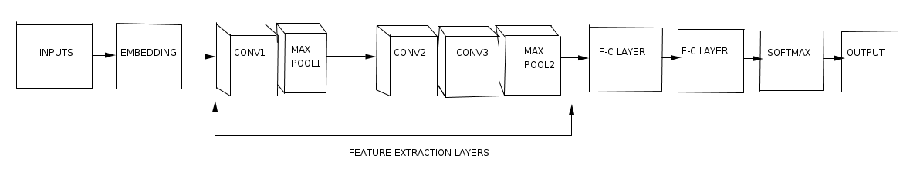
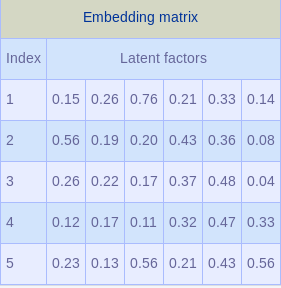
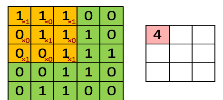
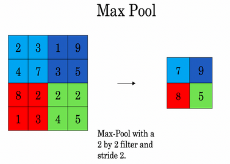

# 'Social Toxicology': A Study of Negative Online Behaviour

Getting harrased for lending your voice to topics you care about on social networks can be irksome. This project is **Deep-push**'s attempt to mitigate the negative effect of toxic comments online.
We are attempting to build a model that’s capable of detecting different types of of toxicity like threats, obscenity, insults, and identity-based hate better than Perspective’s [current models](https://github.com/conversationai/unintended-ml-bias-analysis).

### Requirements

- Python 3
- Tensorflow > 0.12
- Numpy

## Data Pipeline Documentation

In attempting to building a model which reduces the negative effect of toxic comments online, we will need data. We will need training, testing and validation data. The input for our model is suppose to be in the format as illustration  below. 

```[['Deep push makes deep learning interesting',
  'keep working hard',
  'we are interestingly working hard',
  ...],

array([[1,0,0,0,0,0,0],
       [1,0,1,0,0,0,0],
       ...,
       [0,1,1,0,0,0,0]])]```

The format is a list of comments and their corresponding classes. The comments is a list and the classes is an array of one-hot vectors.

It is necessary for every data to be explored. Exploratory Data Analysis in for this challenge will be very useful technique as it can help summarise important characters that the model cannot detect. Mostly this is achieved with the help of visualisation techiques. 

The data should be clean as possible. This is because, some comments include a lot punctuation marks which may have been because the commentor was angry at the time he/she was making the comment. To do this, we write functions that make the data clean, and generate the input for the model.

## Models/Algorithms Documentation

### Example of CNN architecture for our model



### Explanation

### Input layer

The input layer consists of sentences like "Deep push makes deep learning interesting", "keep working hard".

### Embedding

Embedding is a way of representing words and documents using vector representation. The word embedding presents advantages over one-hot encoding because of the following reasons; 

1) One-hot encoded vectors are high dimensional vectors and sparse i.e. most of the entries are zeros. Given a dictionary of size, say 2500 words, each word will be represented by a vector of 2500 integers, among them 2499 will be zeros. This approach is computationally inefficient. The embedding procedure reduces substantially the length allocated to each vector, typical choices are 32 or 50. 

2) In embedding layer, each index standing for a word is allocated a vector of **latent factors** that are updated during the training process.
 
Given a sentence like **Deep push makes deep learning interesting**, to use an embedding layer we first encode it using indices. Each unique word is assigned an integer index, the sentence will be like  123145, where 1 stands for **deep** and so on.

The embedding matrix is then created by deciding how many "latent factors" should be assigned to each index. This simply means how long each vector is supposed to be. As already mentioned, common choices are 32 0r 50, but for simplicity let's assign 6 factors per index for illustration.

 
 
For example, whatever occurs in the word **deep** is represented by [0.15,0.26,0.76,0.21,0.33,0.14]. However, a word is replaced by an index that is used to look-up the vector in the embedding matrix. The embedded vectors get updated during the training process. This process is more efficient for big dataset compared to one-hot version.

Notice that, since entries are sentences, those with few words are padded with zeros at the end when assigning indices to words so that all sentences have the same length.


### Convolution layer.

The convolutional layer is the core building block that performs most of the heavy computations. The convolutional operation computes the sum of the dot product between the elements of the filter (a set of weights)/kernel and the part of the sentence where the filter is applied. It has two main advantages:

1) In the output each neuron is connected to neurons in the previous layer where the filter is applied rather than all neurons in the fully connected manner, this property is known as **local connectivity**. It enables to reduce sensibly the number of parameters in the network.

2) The neural networks learn representations. Early layers may be learning some characters in the words, next layers may be words and later layers should be learning full sentences. Filters are used to detect some features like letters in the word or words in the sentence. Weights associated with each filter are fixed, this roughly means that a filter used to detect a particular character in the part of a sentence/word should be used to detect the same character in another part of a sentence/word. This property is called **parameter sharing** and helps reduce the number of parameters as well.




### Max- pooling layer

Max-pooling works in a way that breaks sentences in parts that are basically numbers. For each part, max-pooling operation outputs the maximum i.e. the maximum value in that part. Roughly speaking what max-pooling is doing is like saying that if this particular character is detected in this part of a sentence keep high value if not may be this character does not appear in this part, as a result the output will be a small value. Max-pooling reduces the number of inputs in the next layer of extraction and subsequently the number of parameters in the network. Here is an example from Deep learning specialisation an online course by Andrew Ng.



### Fully connected layers

Most neural network architetures are ended by some fully connected layers. Neurons in the current layer are fully connected to neurons in the subsequent layer. This kind of layers have many parameters.

### Softmax layer

It handles the multi-classification task. Its neurons correspond to the number classes.


## Kaggle Kernel
